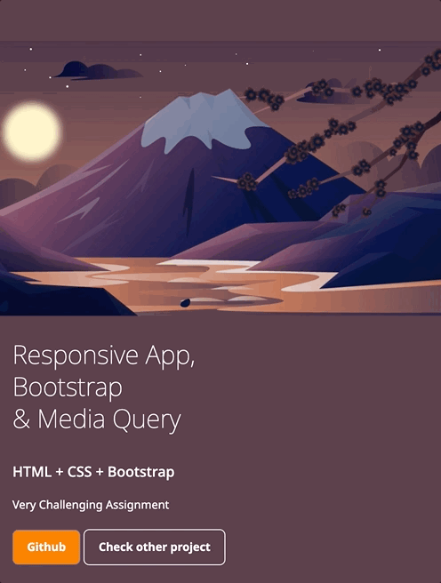

# Reactive (Media Query) + Bootstrap
This is the media query + Bootstrap practice example. 

## Mobile View

## Desktop View

## Live Link
You can see the live demo via: https://hannah-moon.github.io/06_MediaQuery_ResponsiveNav

## Licence
Licensed under the MIT License.
